[TOC]

# Spring

> > 参考视频：[B站狂神](https://www.bilibili.com/video/BV1WE411d7Dv)，写这个只是方便个人复习，怎么写是我自己的事，我能看懂就行，没要求非要让你看！白嫖还挑刺，是很没有风度的事情。希望做个有风度的“五好青年”！
>
> ---

## 1、Spring

### 1.1 简介

- [Spring](https://spring.io/)：春天 ------> 软件行业带来春天
- 2002，首次推出了[Spring了框架](https://baike.baidu.com/item/spring%E6%A1%86%E6%9E%B6/2853288?fr=aladdin)的雏形：[interface21框架](https://www.interface21.io/)！
- Spring框架即以interface21框架为基础,经过重新设计,并不断丰富其内涵,于2004年3月24日,发布了1.0正式版。
- **Rod Johnson**，Spring Framework创始人，著名作者。很难想象Rod Johnson的学历，真的让好多人大吃一惊，他是[悉尼大学](https://baike.baidu.com/item/悉尼大学)的博士，然而他的专业不是计算机，而是音乐学。
-  Spring理念：使现有的技术更加容易使用，本身是一个大杂烩；整合了现有的技术框架。
- SSH：Struct2 + Spring + Hibernate！
- SSM：SpringMVC + Spring + Mybatis！

---

1. 官网：[https://spring.io/projects/spring-framework#overview](https://spring.io/projects/spring-framework#overview)
2. 官方下载地址： [http://repo.spring.io/release/org/springframework/spring](https://repo.spring.io/release/org/springframework/spring)
3. 官方文档：[https://docs.spring.io/spring-framework/docs/current/reference/html/core.html](https://docs.spring.io/spring-framework/docs/current/reference/html/core.html)
4. 中文版官方文档：[https://www.docs4dev.com/docs/zh/spring-framework/5.1.3.RELEASE/reference](https://www.docs4dev.com/docs/zh/spring-framework/5.1.3.RELEASE/reference)

```xml
<!-- https://mvnrepository.com/artifact/org.springframework/spring-webmvc -->
<dependency>
    <groupId>org.springframework</groupId>
    <artifactId>spring-webmvc</artifactId>
    <version>5.2.12.RELEASE</version>
</dependency>

<!-- https://mvnrepository.com/artifact/org.springframework/spring-webmvc -->
<dependency>
    <groupId>org.springframework</groupId>
    <artifactId>spring-jdbc</artifactId>
    <version>5.2.12.RELEASE</version>
</dependency>
```

### 1.2 优点

- Spring是一个开源免费的框架（容器）！
- Spring是一个轻量级的、非入侵式的框架！
- 控制反转（IOC），面向切面编程（AOP）！
- 支持事务的处理，对框架整合的支持！

> 总结：==Spring就是一个轻量级的控制反转（IOC）和面向切面编程（AOP）的框架==。

### 1.3 组成

> 参考：[https://docs.spring.io/spring-framework/docs/4.2.x/spring-framework-reference/html/overview.html](https://docs.spring.io/spring-framework/docs/4.2.x/spring-framework-reference/html/overview.html)

 

> Spring 框架是一个分层架构，由 7 个定义良好的模块组成。 

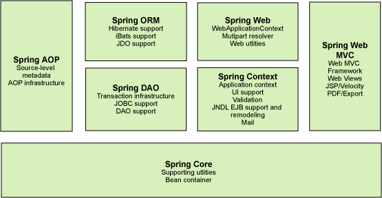 

### 1.4 拓展

- 在[Spring的官网](https://spring.io.xy2401.com/)有这个介绍：现代化的Java开发！说白了就是基于Spring的开发！

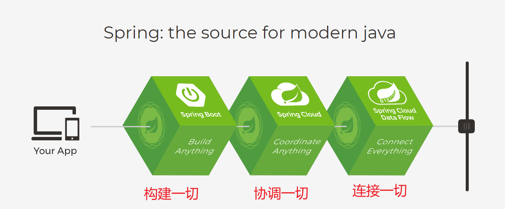

- Spring Boot
  - 一个快速开发的脚手架。
  - 基于Spring Boot 可以快速开发单个微服务。
  - 约定大于配置！
- Spring Cloud
  - Spring Clound 是基于Spring Boot 实现的。

> **为什么要学Spring?**
>
> 因为：现在大多数公司都在使用 Spring Boot 进行快速开发，学习 Spring Boot 的前提，需要完全掌握 Spring 及 Spring MVC！承上启下的作用！

> 弊端：发展了太久之后，违背了原来的理念！配置十分繁琐，人称：“配置地狱！”。

----

## 2、IOC理论推导

### 2.1 引例

> 先构建下图基本框架，并导入maven环境文件。

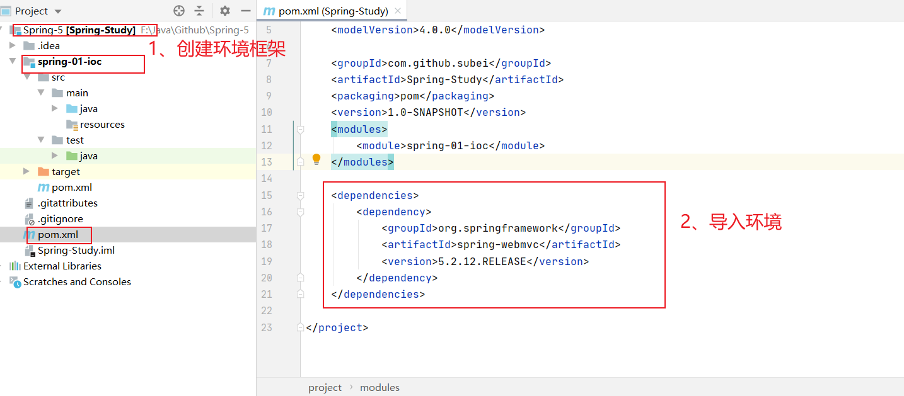

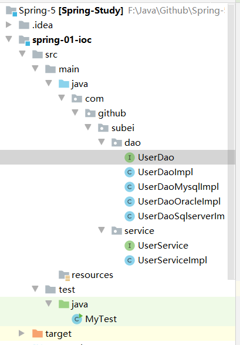

1. UserDao 接口

   ```java
   package com.github.subei.dao;
   
   public interface UserDao {
       void getUser();
   }
   ```

2. UserDaoImpl 实现类

   ```java
   package com.github.subei.dao;
   
   public class UserDaoImpl implements UserDao{
       public void getUser() {
           System.out.println("默认获取用户的数据……");
       }
   }
   ```

3. UserService 业务接口

   ```java
   package com.github.subei.service;
   
   public interface UserService {
       void getUser();
   }
   ```

4. UserServiceImpl 业务实现类

   ```java
   package com.github.subei.service;
   
   import com.github.subei.dao.UserDao;
   import com.github.subei.dao.UserDaoImpl;
   
   public class UserServiceImpl implements UserService{
       private UserDao userDao = new UserDaoImpl();
   
       public void getUser() {
           userDao.getUser();
       }
   }
   ```

5. 测试类MyTest

   ```java
   import com.github.subei.service.UserServiceImpl;
   
   public class MyTest {
       public static void main(String[] args) {
           // 用户实际调用的是业务层，dao层不需要接触
           UserServiceImpl userService = new UserServiceImpl();
   
           userService.getUser();
       }
   }
   ```

   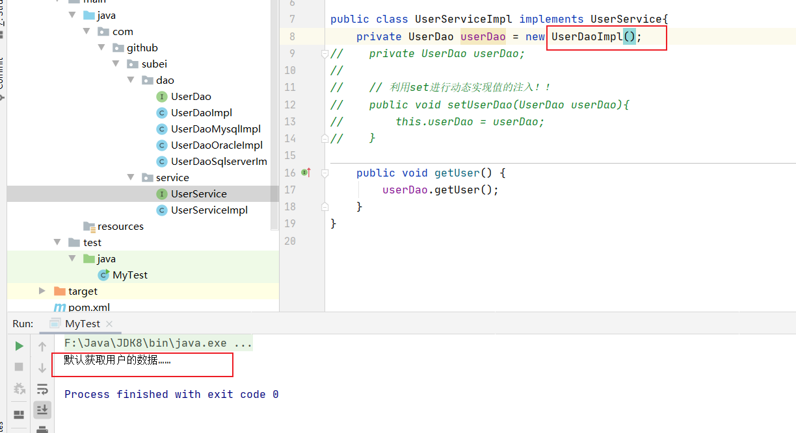

   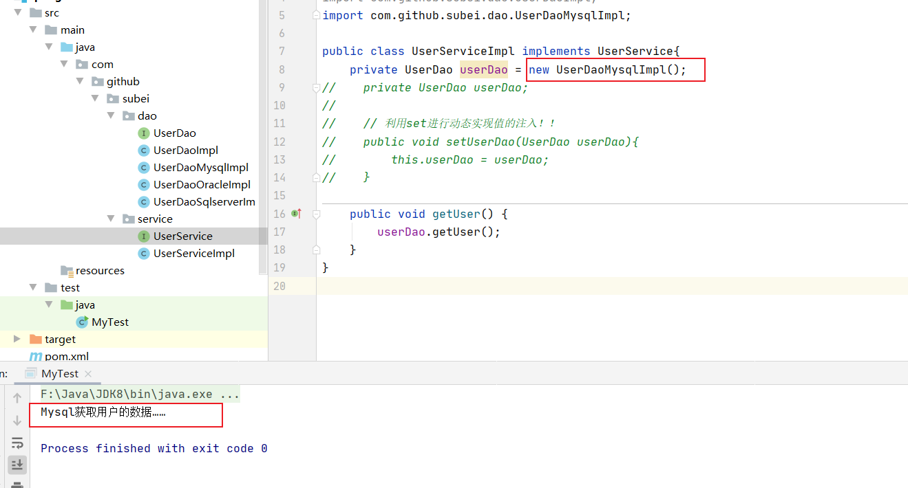

   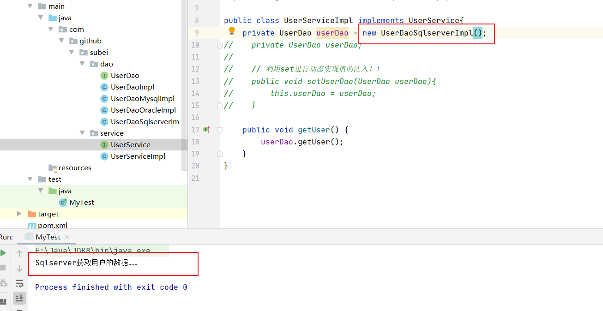

> 在我们之前的业务中，用户的需求可能会影响我们原来的代码，我们需要根据用户的需求去修改原代码！如果程序代码量十分大，修改一次的成本十分昂贵。

- 我们使用一个set接口实现。修改UserServiceImpl.java文件

```java
package com.github.subei.service;

import com.github.subei.dao.UserDao;

public class UserServiceImpl implements UserService{
//    private UserDao userDao = new UserDaoImpl();
    private UserDao userDao;

    // 利用set进行动态实现值的注入！！
    public void setUserDao(UserDao userDao){
        this.userDao = userDao;
    }

    public void getUser() {
        userDao.getUser();
    }
}
```

- 测试类

```java
import com.github.subei.dao.UserDaoSqlserverImpl;
import com.github.subei.service.UserServiceImpl;

public class MyTest {
    public static void main(String[] args) {
        // 用户实际调用的是业务层，dao层不需要接触
        UserServiceImpl userService = new UserServiceImpl();

        userService.setUserDao(new UserDaoSqlserverImpl());
        userService.getUser();
    }
}
```

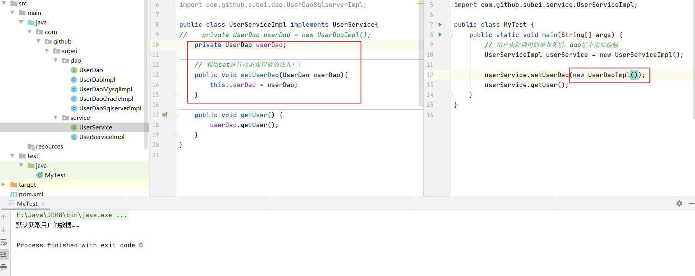

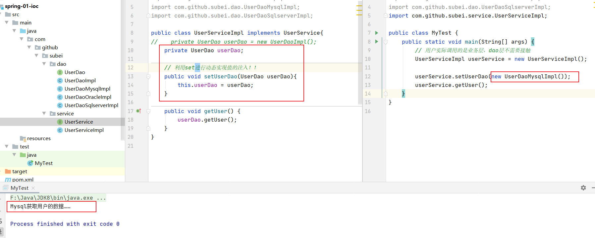

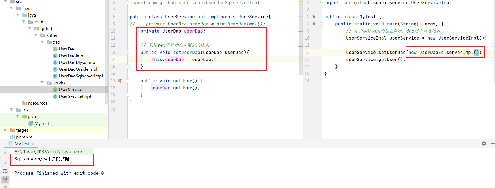

- 之前，程序是主动创建对象！控制权在程序猿手上！
- 使用了set注入后，程序不再具有主动性，而是变成了被动的接受对象！

> 这种思想，从本质上解决了问题，我们程序猿不用再去管理对象的创建了。系统的耦合性大大降低，可以更加专注的在业务的实现上！==这是IOC的原型==。

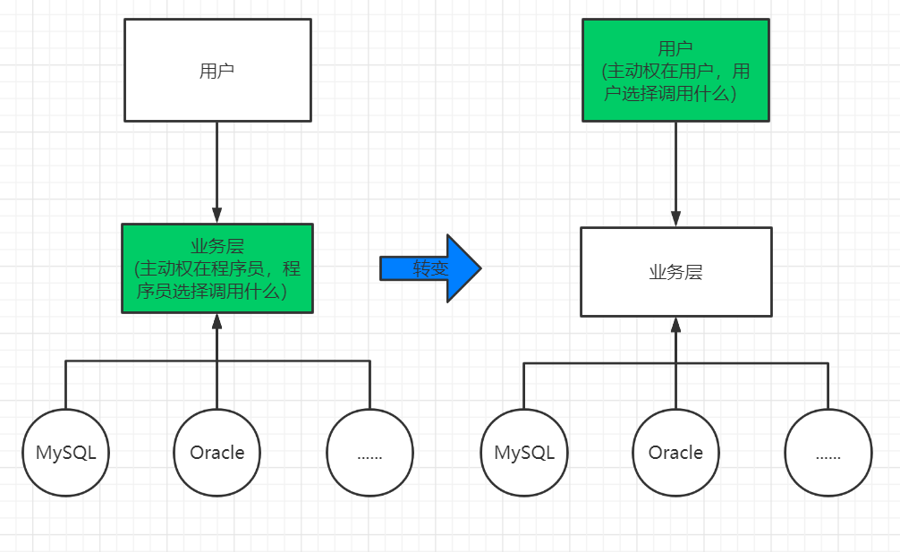

### 2.2 IOC的本质

> **控制反转loC(Inversion of Control)，是一种设计思想，DI（依赖注入）是实现loC的一种方法**，也有人认为DI只是loC的另一种说法。没有loC的程序中，我们使用面向对象编程，对象的创建与对象间的依赖关系完全硬编码在程序中，对象的创建由程序自己控制，控制反转后将对象的创建转移给第三方，个人认为所谓控制反转就是：获得依赖对象的方式反转了。

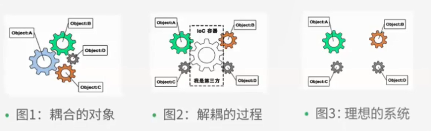

- **IoC是Spring框架的核心内容**，使用多种方式完美的实现了IoC，可以使用XML配置，也可以使用注解，新版本的Spring也可以零配置实现IoC。

- Spring容器在初始化时先读取配置文件，根据配置文件或元数据创建与组织对象存入容器中，程序使用时再从Ioc容器中取出需要的对象。

  

- 采用XML方式配置Bean的时候，Bean的定义信息是和实现分离的，而采用注解的方式可以把两者合为一体，Bean的定义信息直接以注解的形式定义在实现类中，从而达到了零配置的目的。
- **控制反转是一种通过描述（XML或注解）并通过第三方去生产或获取特定对象的方式。在Spring中实现控制反转的是IoC容器，其实现方法是依赖注入（Dependency Injection,DI）。**

## 3、HelloSpring

> 新建项目，导入Jar包

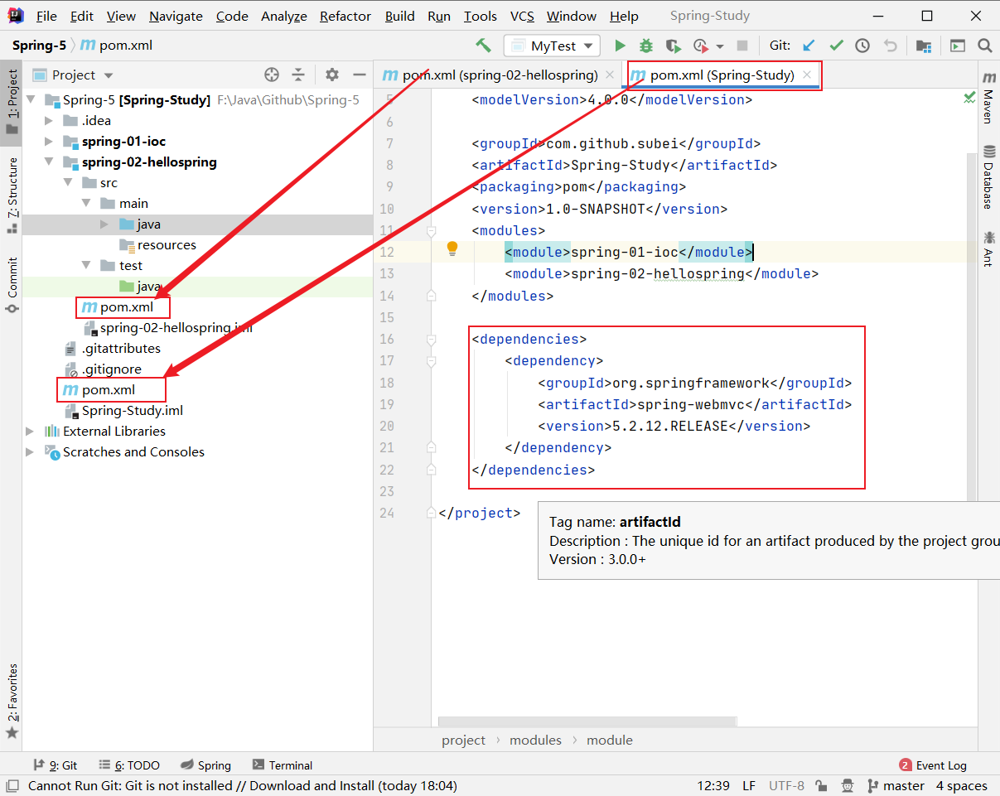

- 注 : spring 需要导入commons-logging进行日志记录 . 利用maven , 它会自动下载对应的依赖项。

```xml
    <dependencies>
        <dependency>
            <groupId>org.springframework</groupId>
            <artifactId>spring-webmvc</artifactId>
            <version>5.2.12.RELEASE</version>
        </dependency>
    </dependencies>
```

> 编写代码：

1. 编写一个Hello实体类 

```java
package com.github.subei.pojo;

public class Hello {
    private String src;

    public String getSrc() {
        return src;
    }

    public void setSrc(String src) {
        this.src = src;
    }

    @Override
    public String toString() {
        return "Hello{" +
                "src='" + src + '\'' +
                '}';
    }
}
```

2. 编写spring文件 , 这里命名为beans.xml

```xml
<?xml version="1.0" encoding="UTF-8"?>
<beans xmlns="http://www.springframework.org/schema/beans"
       xmlns:xsi="http://www.w3.org/2001/XMLSchema-instance"
       xsi:schemaLocation="http://www.springframework.org/schema/beans
        http://www.springframework.org/schema/beans/spring-beans.xsd">

    <!--使用Spring来创建对象，在spring这些部称Bean-->
    <bean id="hello" class="com.github.subei.pojo.Hello">
        <property name="src" value="Spring"/>
    </bean>

</beans>
```

3、我们可以去进行测试了 .

```java
import com.github.subei.pojo.Hello;
import org.springframework.context.ApplicationContext;
import org.springframework.context.support.ClassPathXmlApplicationContext;

public class MyTest {
    public static void main(String[] args) {
        //解析beans.xml文件 , 生成管理相应的Bean对象
        ApplicationContext context = new ClassPathXmlApplicationContext("beans.xml");
        //getBean : 参数即为spring配置文件中bean的id .
        Hello hello = (Hello) context.getBean("hello");
        System.out.println(hello.toString());
    }
}
```

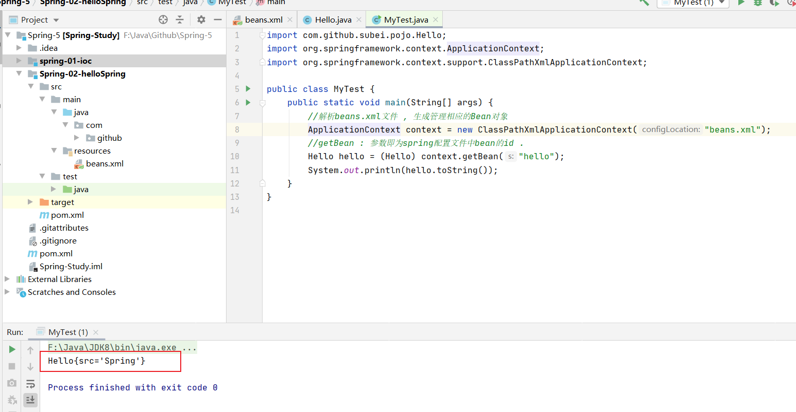

> 思考：

- Hello 对象是谁创建的 ?  
  - hello 对象是由Spring创建的。
- Hello 对象的属性是怎么设置的 ?  
  - hello 对象的属性是由Spring容器设置的。

> 这个过程就叫控制反转 :

- 控制 : 谁来控制对象的创建 , 传统应用程序的对象是由程序本身控制创建的 , 使用Spring后 , 对象是由Spring来创建的。
- 反转 : 程序本身不创建对象 , 而变成被动的接收对象。

> 依赖注入 : 就是利用set方法来进行注入的。

- IOC是一种编程思想，由主动的编程变成被动的接收。

- 可以通过new ClassPathXmlApplicationContext去浏览一下底层源码。

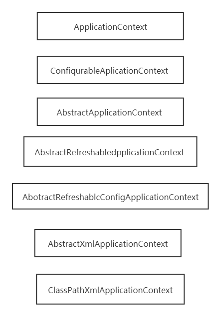

> 修改案例一：

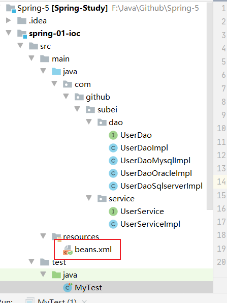

- 在案例一中， 新增一个Spring配置文件beans.xml

```xml
<?xml version="1.0" encoding="UTF-8"?>
<beans xmlns="http://www.springframework.org/schema/beans"
       xmlns:xsi="http://www.w3.org/2001/XMLSchema-instance"
       xsi:schemaLocation="http://www.springframework.org/schema/beans
        http://www.springframework.org/schema/beans/spring-beans.xsd">

    <bean id="mysqlImpl" class="com.github.subei.dao.UserDaoMysqlImpl"/>
    <bean id="oracleImpl" class="com.github.subei.dao.UserDaoOracleImpl"/>

    <bean id="UserServiceImpl" class="com.github.subei.service.UserServiceImpl">
        <!--
        ref:引用spring容器中创建好的对象!
        value:具体的值，基本数帮类型！
        -->
        <property name="userDao" ref="mysqlImpl"/>
    </bean>

</beans>
```

- 测试！

```java
    @Test
    public void test2(){
        // 获取AppLicationcontext;拿到Spring容器
        ApplicationContext context = new ClassPathXmlApplicationContext("beans.xml");
        UserServiceImpl serviceImpl = (UserServiceImpl) context.getBean("UserServiceImpl");
        serviceImpl.getUser();
    }
```

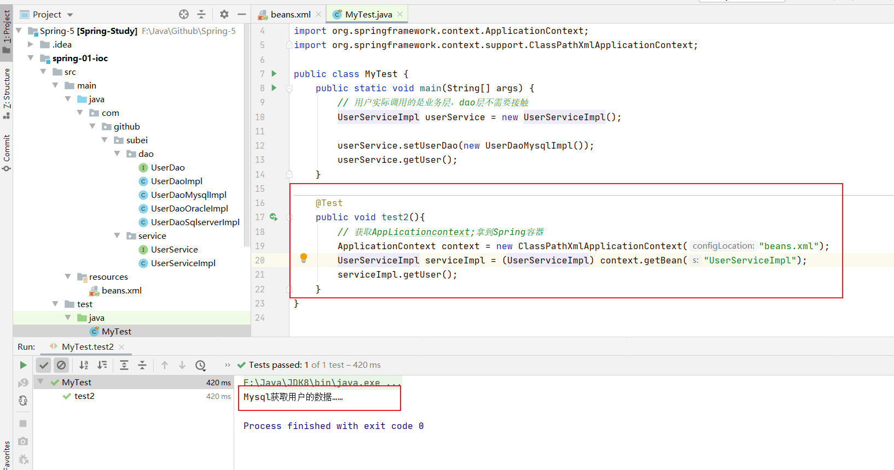

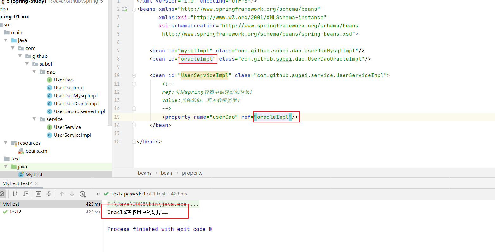

- ==OK , 到了现在 , 彻底不用再程序中去改动了 , 要实现不同的操作 , 只需要在xml配置文件中进行修改 , 所谓的IoC，一句话搞定 : 对象由Spring 来创建 , 管理 , 装配 !== 

## 4、IOC创建对象方式

### 4.1 方式一

> 方式一：通过无参构造方法来创建。

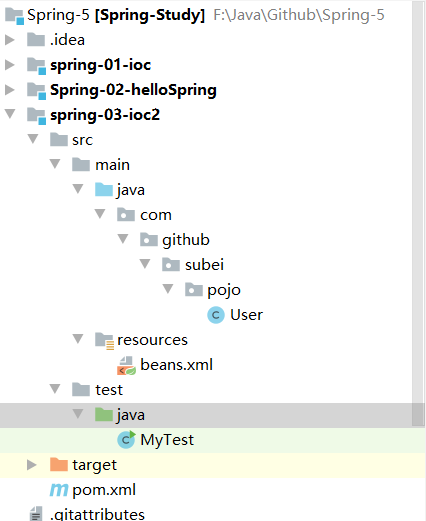

1. User.java

```java
package com.github.subei.pojo;

public class User {
    private String name;

    public User() {
        System.out.println("User的无参构造！");
    }

    public String getName() {
        return name;
    }

    public void setName(String name) {
        this.name = name;
    }

    public void show(){
        System.out.println("name="+ name );
    }
}
```

2. beans.xml

```xml
<?xml version="1.0" encoding="UTF-8"?>
<beans xmlns="http://www.springframework.org/schema/beans"
       xmlns:xsi="http://www.w3.org/2001/XMLSchema-instance"
       xsi:schemaLocation="http://www.springframework.org/schema/beans
        http://www.springframework.org/schema/beans/spring-beans.xsd">

    <bean id="user" class="com.github.subei.pojo.User">
        <property name="name" value="subei"/>
    </bean>

</beans>
```

3. 测试类

```java
import com.github.subei.pojo.User;
import org.springframework.context.ApplicationContext;
import org.springframework.context.support.ClassPathXmlApplicationContext;

public class MyTest {
    public static void main(String[] args) {
        ApplicationContext context = new ClassPathXmlApplicationContext("beans.xml");
        // 在执行getBean的时候, user已经创建好, 通过无参构造
        User user = (User) context.getBean("user");
        // 调用对象的方法 .
        user.show();
    }
}
```

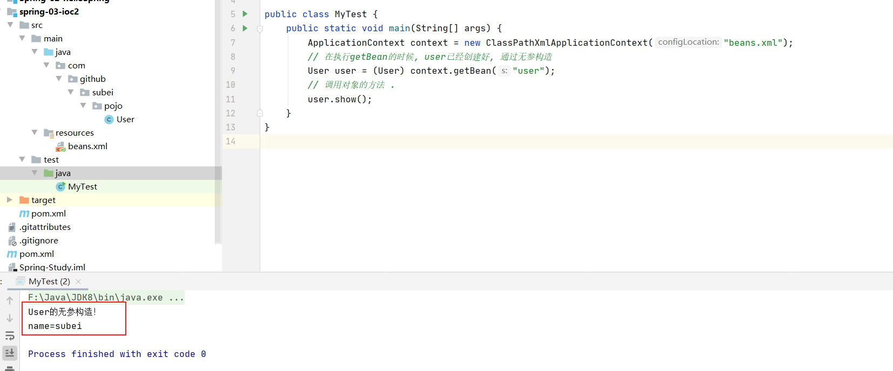

- 通过debug可以发现，在调用show方法之前，User对象已经通过无参构造初始化了！

---

### 4.2 方式二

> 方式二：通过有参构造方法来创建。

1.UserT . java

```java
package com.github.subei.pojo;

public class UserT {
    private String name;

    public UserT(String name) {
        this.name = name;
    }

    public String getName() {
        return name;
    }

    public void setName(String name) {
        this.name = name;
    }

    public void show() {
        System.out.println("name=" + name);
    }

}
```

2、beans.xml 有三种方式编写

```xml
<?xml version="1.0" encoding="UTF-8"?>
<beans xmlns="http://www.springframework.org/schema/beans"
       xmlns:xsi="http://www.w3.org/2001/XMLSchema-instance"
       xsi:schemaLocation="http://www.springframework.org/schema/beans
        http://www.springframework.org/schema/beans/spring-beans.xsd">

    <!-- 第一种：根据index参数下标设置 -->
<!--    <bean id="userT" class="com.github.subei.pojo.UserT">-->
<!--        <constructor-arg index="0" value="subeily——"/>-->
<!--    </bean>-->


    <!-- 第二种：根据参数类型设置，不建议使用 -->
<!--    <bean id="userT" class="com.github.subei.pojo.UserT">-->
<!--        <constructor-arg type="java.lang.String" value="subeily2——"/>-->
<!--    </bean>-->

    <!-- 第三种：根据参数名字设置 -->
    <bean id="userT" class="com.github.subei.pojo.UserT">
        <!-- name指参数名 -->
        <constructor-arg name="name" value="subeily3——"/>
    </bean>

</beans>
```

3、测试

```java
    @Test
    public void test(){
        ApplicationContext context = new ClassPathXmlApplicationContext("beans.xml");
        // 在执行getBean的时候, user已经创建好, 通过无参构造
        UserT user = (UserT) context.getBean("userT");
        // 调用对象的方法 .
        user.show();
    }
```

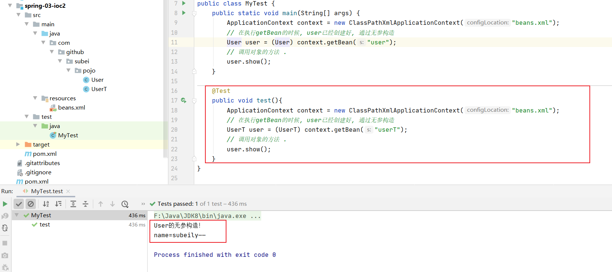

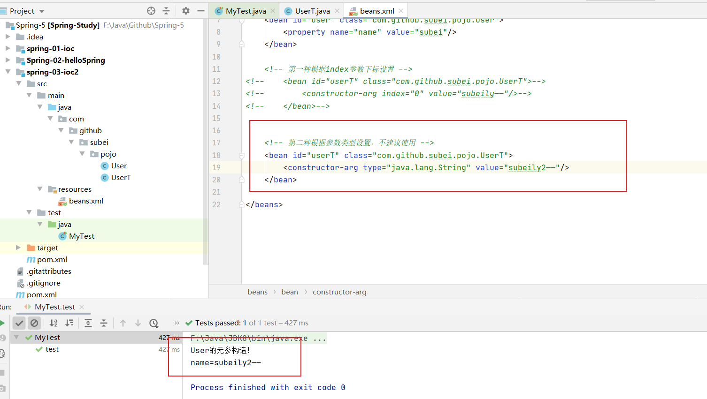

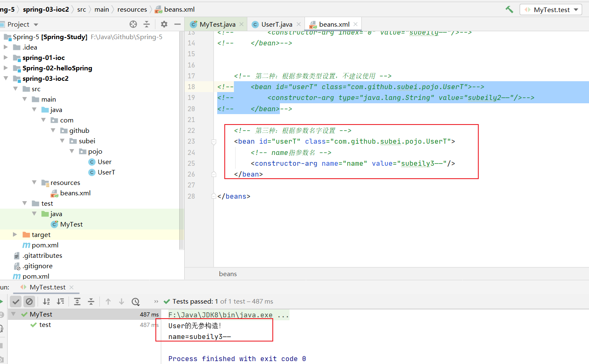

> 总结：在配置文件加载的时候，容器中管理的对象就已经初始化了！

## 5、Spring配置

### 5.1 别名

- alias 设置别名 , 为bean设置别名 , 可以设置多个别名。

```xml
<!--设置别名：在获取Bean的时候可以使用别名获取-->
<alias name="userT" alias="userNew"/>
```


### 5.2 Bean的配置

```xml
<!--bean就是java对象,由Spring创建和管理-->

<!--
   id 是bean的标识符,要唯一,如果没有配置id,name就是默认标识符
   如果配置id,又配置了name,那么name是别名
   name可以设置多个别名,可以用逗号,分号,空格隔开
   如果不配置id和name,可以根据applicationContext.getBean(.class)获取对象;

class是bean的全限定名=包名+类名
-->
<bean id="hello" name="hello2 h2,h3;h4" class="com.kuang.pojo.Hello">
   <property name="name" value="Spring"/>
```


### 5.3 import

团队的合作通过import来实现 .

```xml
<import resource="{path}/beans.xml"/>
```
